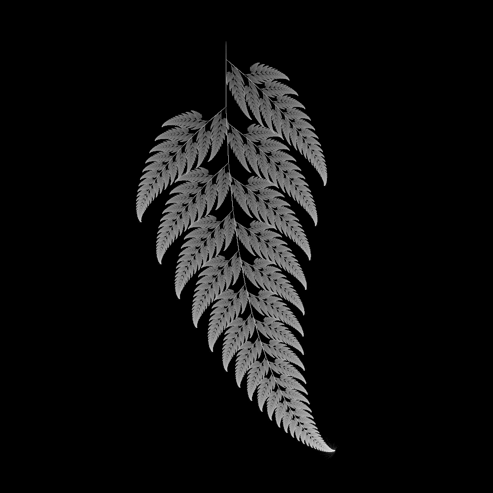
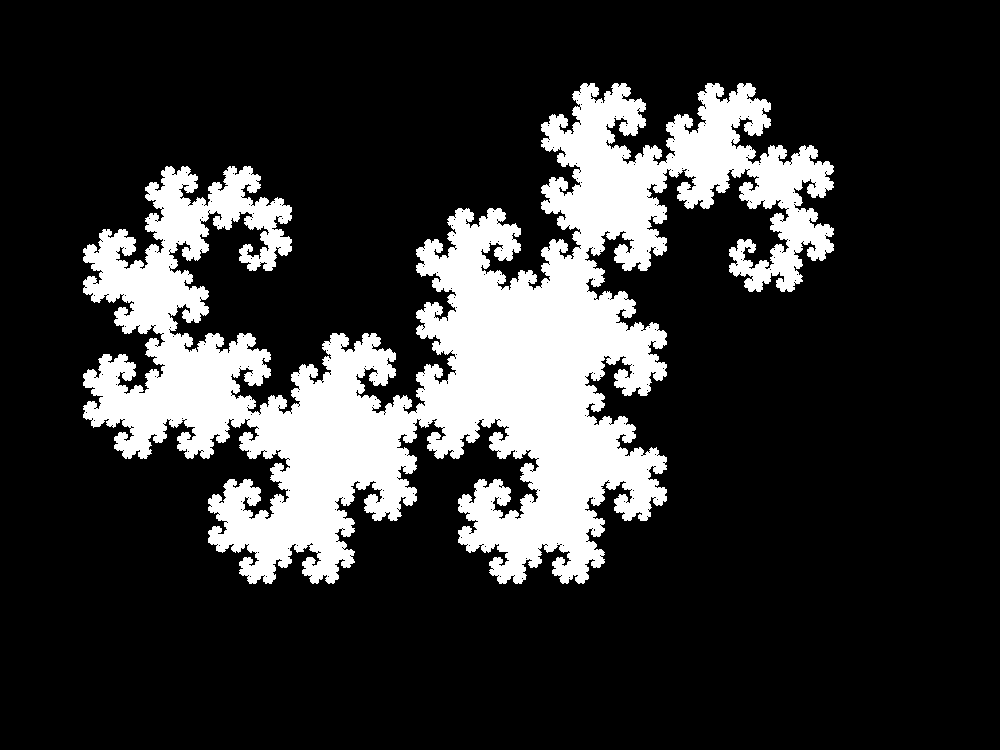
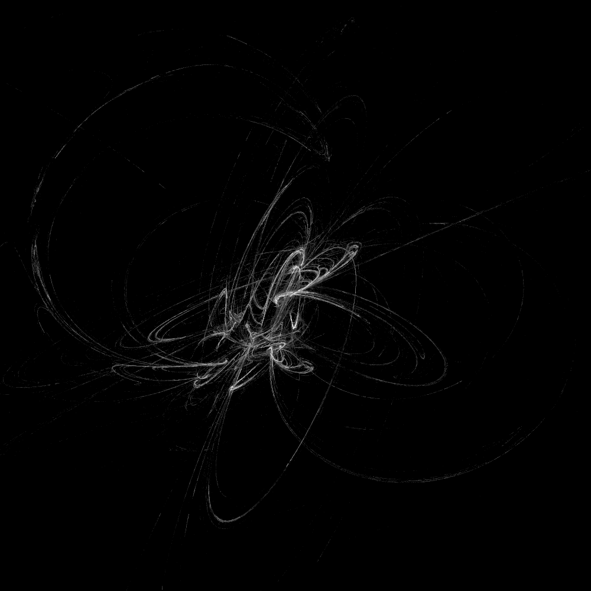
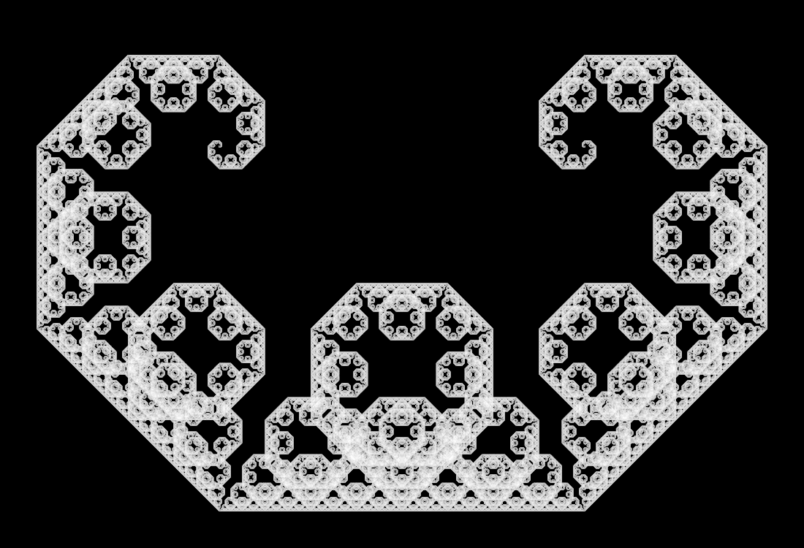
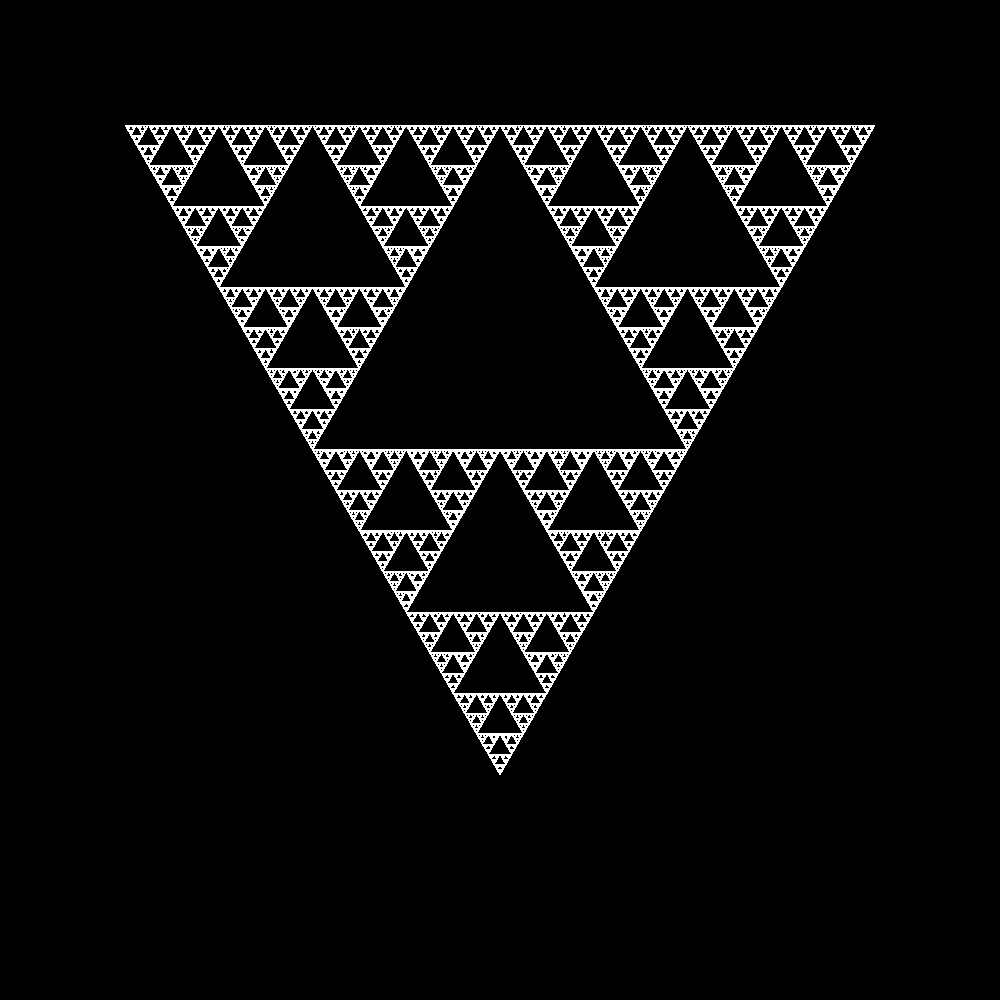

# IFS Fractals

This project implements so called iterated function systems and makes it possible to make approximate plots of the fixed sets of the system. Many fractals can be considered as fixed sets of iterated function systems, including the Sierpinski carpet and flame fractals. See the "demo" package for examples of plots.

# Images
Below are outputs from the demos. All source code can be found in the 

Barnsley's fern.

Drangon curve.

Fractal flame.

Levy C Curve.

Sierpinski's triangle.

/Jonas (mail@jonaslindstrom.dk)
