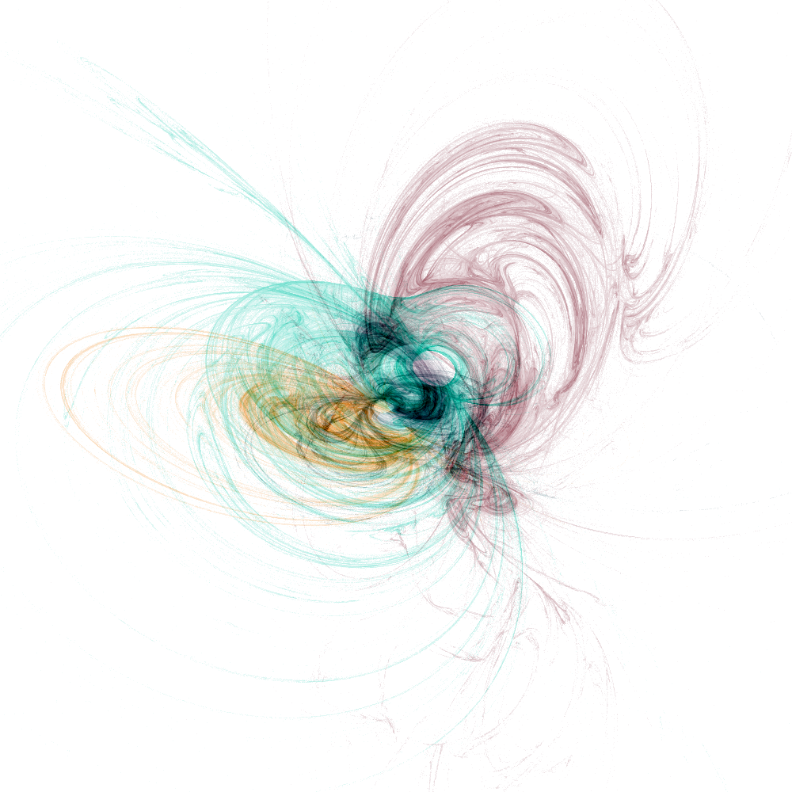
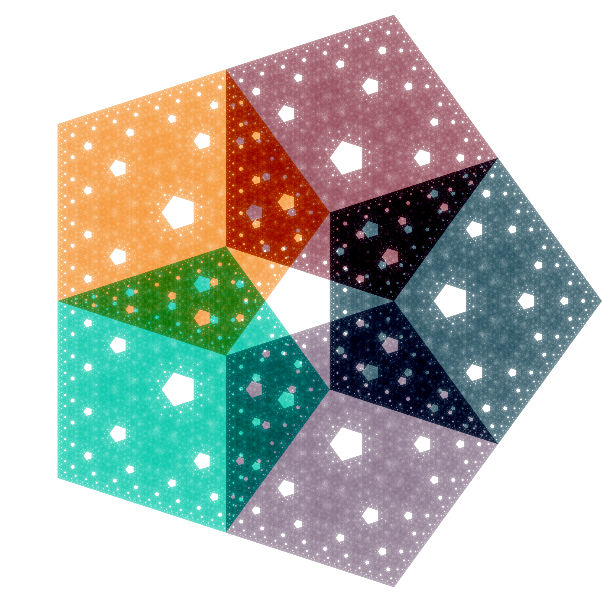
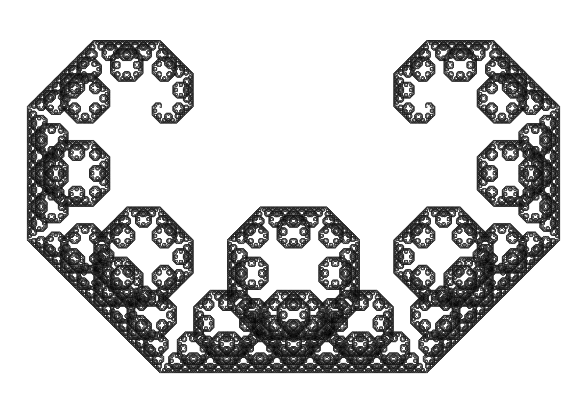
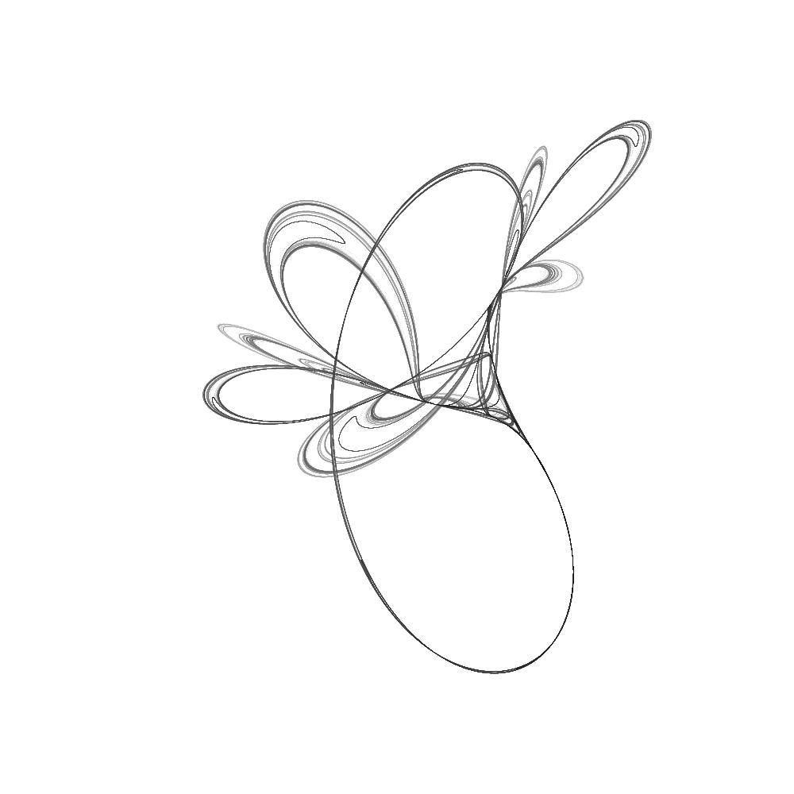
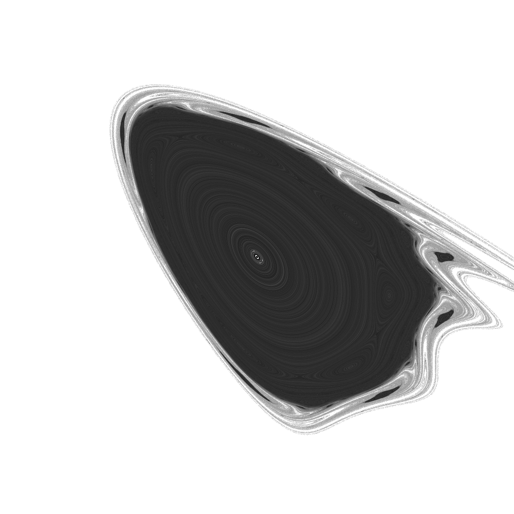

# IFS Fractals

This project implements so called iterated function systems and makes it
possible to make approximate plots of the fixed sets of the system. 
Many fractals can be considered as fixed sets of iterated function systems, 
including the Sierpinski carpet and flame fractals. See the "demo" package 
for examples of plots.

# Functions
Currently, the library has demos to make images of attractors of the following systems:
* Barnsleys Fern
* The Bogdanov Map
* Dragon Curve
* Fractal Flame
* The Ikeda Map
* Levy C Curve
* Sierpinski Triangle
* Tinkerbell Map

# Images
Below are outputs from some of the demos. All source code can be found in the [demo-folder](src/dk/jonaslindstrom/ifs/demos)

Sierpinski's triangle.

Fractal flame.

Barnsley's fern.

Tinkerbell Map.

Dragon curve.

Levy C Curve.

Ikeda Map.

Tinkerbell Map.

Bogdanov Map.

/Jonas (mail@jonaslindstrom.dk)
